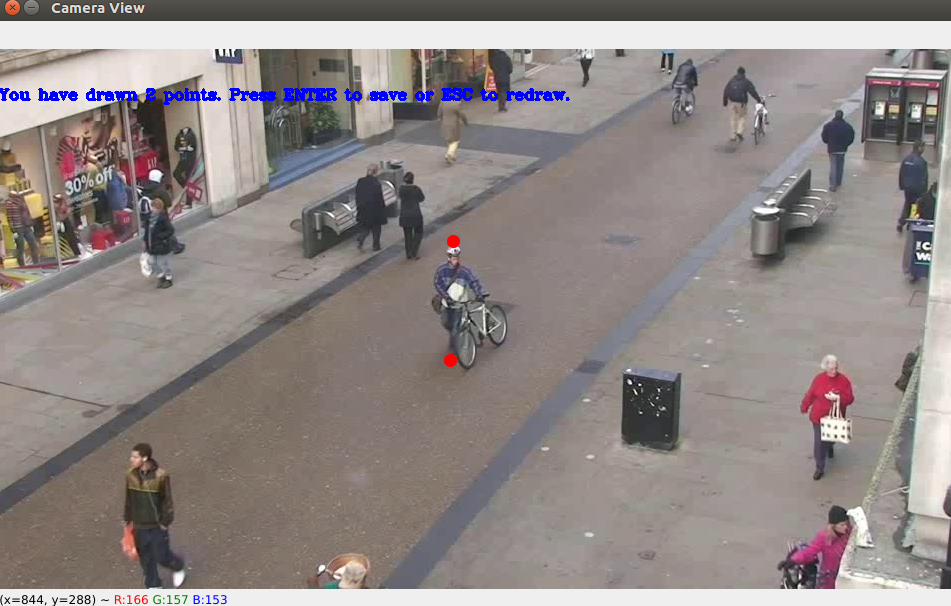

# Social Distancing
This repository implements the social distancing violation detection to reduce the spread of COVID-19 and other diseases by ensuring social distancing in public places including shopping malls, hospitals and restaurants.

# Demo
A demo video can be found at https://youtu.be/gXX8fuQbUFI. 
Note that **Yolov4-tiny** has been used as person detector in this demo video. 
The *yolo.weights*, *yolo.cfg*, and *classes.txt* files can be found at [yolov4-tiny](https://drive.google.com/drive/folders/17R-8klyLgYH2b7Fy7ZJ6Sd1k2lr3-zEv?usp=sharing). 
The non-annotated video can also be found at [non_annotated_video](https://drive.google.com/file/d/1EWGd1HvjlFfe0mFnYk0l3qjBnKu3gTcY/view?usp=sharing). 
A sample calibration file for this video can be found at [calibration.pkl](https://drive.google.com/file/d/1bRxsVk5CrfMuyebWEbhqnxDKvkKpd5TL/view?usp=sharing).

# Calibration
Two types of calibrations are needed for this application.
1. Calibration for estimating the **transformation matrix** to transform camera view image to top view
1. Estimation of **scale factor**, e.g. how many pixels correspond to 6 feet (1.83 m) in real life.

## Camera View to Top View Transformation
Homography transformation is used to estimate the transformation matrix.
For this purpose, we need to mark at least 4 points on both of the camera view and top view.
The below picture shows a simple description of the process.


Note that the road is perfectly aligned in the above transformed image.

## Scale Factor Estimation
For the estimation of scale factor, the user will be asked to mark multiple 6 feet (1.83 m) apart pair of points on the camera view.

For simplicity, we assumed that the approx. height of a person is around 6 feet (1.83 m). 
Hence, the user will be marking the points at the head and foot location of a person in the camera view. 

The program then takes the average of all such pairs and estimate the scale factor to transform the pixel distance in feet.



**NOTE:** The calibration functionality can be accessed using the python script [calibrate.py](calibrate.py).

# Installation

## Requirements
1. Linux (Tested on Ubuntu 16.04 LTS, it should work fine on any ubuntu 18.04 LTS and 20.04 LTS as well)
1. Python 3.8 (Tested with python 3.8, it should work fine with Python 3.6+)

## Install Requirements
**NOTE: A separate conda environment is recommended for this project.**
1. Create and activate a new conda environment using commands 
    ```
    $ conda create --name social_distancing python=3.8
    $ conda activate social_distancing 
                        OR 
    $ source activate social_distancing
    ``` 
1. Install requirements using pip
    ```
    $ pip install -r requirements.txt
    ```

# Configuration
The program configuration file can be found at [config.yml](config.yml). A sample configuration file is listed below.
```
person_detector:
  name: opencv_yolo
  checkpoint_path: ./data/yolov4_tiny

calibration:
  image_transformation: homography
  pkl_file_path: ./data/calibration.pkl

social_distancing:
  distance_threshold_ft: 6
```
For the detailed description of the configuration parameters, please have a look at [config.yml](config.yml).

# Running the Scripts

## calibrate.py
This script will perform the calibrations. Run it like,
```
$ python calibrate.py -v <video_path> -n <num_points> -iter <num_iterations>
```
where,
1. **<video_path>:** Path to the video file path.
1. **<num_points>:** Number of corresponding points to estimate homography transformation. 
Note that minimum 4 points are required to calculate the homography.
1. **<num_iterations>:** Number of iterations (pair of points) for finding the scale factor.

For help, run
```
$ python calibrate.py --help
```
For example consider,
**num_points = 4** and **num_iterations = 2**, then if you run the following command,
```
$ python calibrate.py -v /home/maaz/video.mp4 -n 4 -iter 2
```
1. Firstly, the system will ask you to draw 4 points on the camera view and press ENTER. 
1. Secondly, you will be asked to draw 4 corresponding points on the top view and press ENTER. 
Then system will show you the transformed image. Now, you should press ENTER to begin the estimation of scale factor.
1. Now the system will show you the camera view image, and you will mark 2 points (one at head and second at foot) of a person, and press ENTER.
1. You will repeat the above step for one more time (total 2, as num_iterations = 2)
1. That's all, now the system will save the calibration pkl file in at the path mentioned in the configuration file [config.yml](config.yml).

## violation_detection.py
This script will run the social distancing violation logic on a video and produced the violation video. 
The script will draw a red line between two persons for which social distance violation is detected.
Run the script as,
```
$ python violation_detection.py -v <video_path>
```
Where **<video_path>** is the camera video file path. 
The output video is saved in the same directory containing the video file.

For help, run
```
$ python violation_detection.py --help
```

## runme.sh
This bash script is developed to provide an interactive way of performing calibration and running social distancing violation logic on a video. 
Follow the below instructions,

1. Make the script executable
```
$ sudo chmod +x ./runme.sh
```
1. Run the script as
```
$ ./runme.sh <python_executable_path> <video_file_path> <calibration_file_path>
```
Note that the script expect three (3) positional arguments, where the third argument (*calibration_file_path*) is optional. 
If provided, the system will use this calibration file for core logic, otherwise the system will ask the user to perform the calibration first.

For help, run
```
$ ./runme help
```
**NOTE:** *runme.sh* script is the preferred method of accessing the functionality of this repository.

# Adding a Custom Person Detector
All code related to `person_detector` can be found in the directory [person_detector](person_detector). 
In order to add a new person detector, you need to do the following,
1. Add a `.py` file (lets say `custom_person_detector.py`) in the `person_detector` directory. 
   This file should implement a `CustomPersonDetector` class. The class must contain a method named `do_inference`. 
   The signature of the `do_inference` method are mentioned below
   ```
   def do_inference(self, image, confidence_threshold, nms_threshold):
        """
        This function does inference on the image passed and return the person bounding boxes

        :param image: A BGR numpy array (i.e. the result of cv2.imread() or read() call after cv2.VideoCapture())
        :param nms_threshold: Non Maximal Threshold for YOLO object detector
        :param confidence_threshold: Minimum confidence threshold below which all boxes should be discarded

        :return: List of person bounding boxes ([[x, y, w, h, confidence], ...])
        """
   ```
1. Add the detector in the [detector.py](person_detector/detector.py) file so that it can be used using the [config](config.yml) file.

# Progress
- [x] Add OpenCV darknet Yolov3 as person detector
- [x] Add Homography Image Transformation as a module to generate transformation matrix for bird eye view projection
- [x] Add calibration tool to map camera image to bird eye view
- [x] Develop an end-to-end application flow to detect social distancing violations using above tools
- [x] Add a bash script to run the end-to-end social distancing violation detector on a video
- [x] Add *requirements.txt*
- [x] Add complete instructions to run the code in the README
- [x] Add demo video link and other required resources to reproduce the demo results.
- [x] Add instructions to add custom person detector into the project

# Collaboration
The pull requests are welcome. Please email me at **mmaaz60@gmail.com** if you have any questions.
