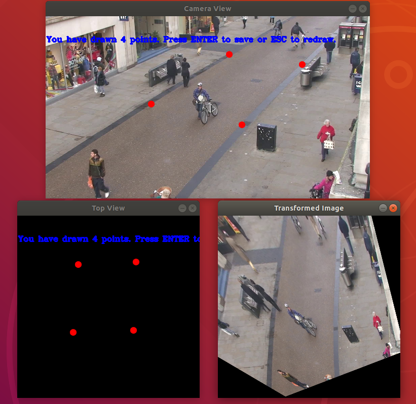

# Social Distancing
This repository implements the social distancing violation detection to reduce the spread of COVID-19 and other diseases by ensuring social distancing in public places including shopping malls, hospitals and restaurants.

# To Be Continue
Stay tuned, a robust and modular implementation of Social Distancing Violation detection is coming soon.

# Image Transformation

Note that the road is perfectly aligned in the above transformed image.

# TODO
- [x] Add OpenCV darknet Yolov3 as person detector
- [x] Add Homography Image Transformation as a module to generate transformation matrix for bird eye view projection
- [ ] Add calibration tool to map camera image to bird eye view
- [ ] Develop an end-to-end application flow to detect social distancing violations using above tools
- [ ] Add instructions to add custom person detector into the project
- [ ] Add instructions to add any other image transformation (e.g. perspective transformation etc.)
- [ ] Add MGAN based person detector from [Pedestron](https://github.com/hasanirtiza/Pedestron.git)

# Collaboration
I am looking for the resources to collaborate with me on this project. Please email me at **mmaaz60@gmail.com** if you want to collaborate with me on this project.
